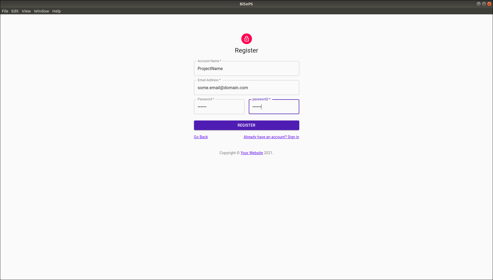
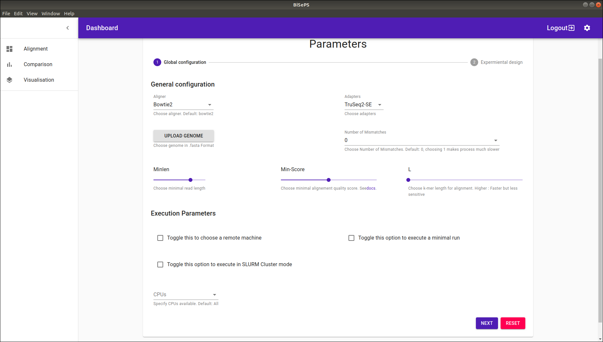
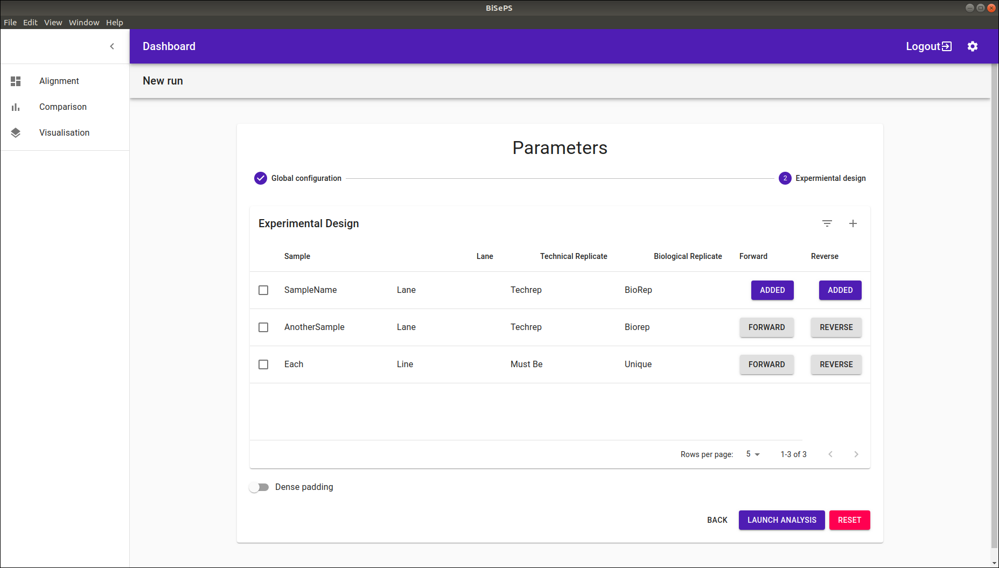
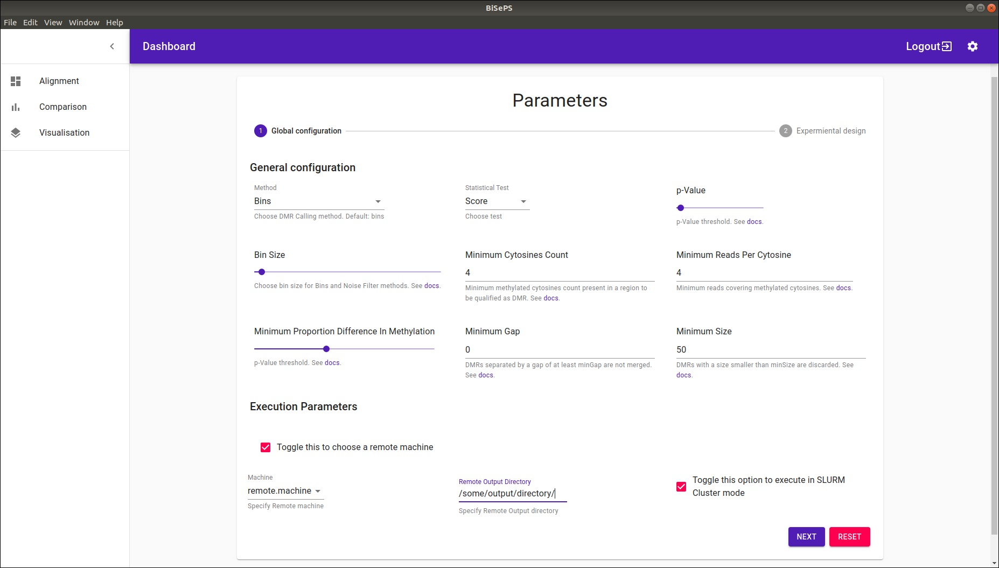
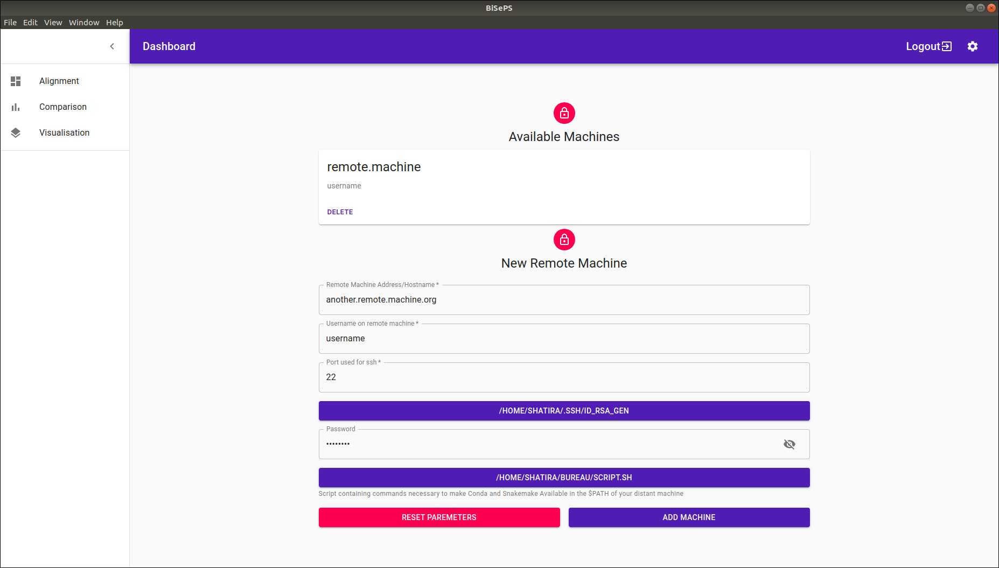
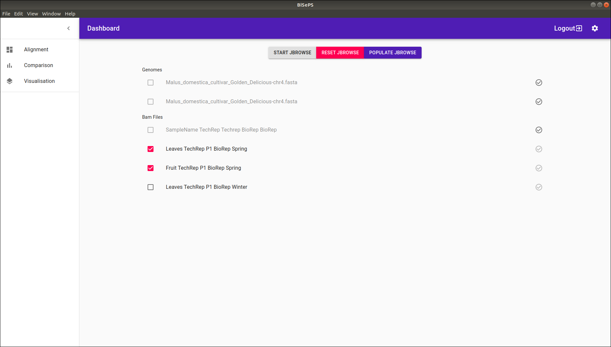

# BiSePS : Bisulfite Sequencing Processing Software Graphical User Interface

Features:

- Account Creation
- Run Alignments and Identify DMR's
- Deploy per-account Jbrowse
- Remote execution
- Slurm Cluster Support
- MacOS, Windows and Linux executable with an app icon



## Requirements

These need to be accessible in your $PATH for the software to run properly

- `conda` - [miniconda](https://docs.conda.io/en/latest/miniconda.html) for package management.
- `git` - [git](https://git-scm.com/). This is necessary to always get the latest version of **BiSePS Pipeline**.

## Installation

To run this repository as a developper you'll need [Node.js](https://nodejs.org/en/download/) and [yarn](https://yarnpkg.com/) installed on your computer. From your command line:

```bash
# Install dependencies
$ yarn
# Run the app
$ yarn start
# Build the packages
$ yarn make
```

To intall this software on your machine just go to the download menu and click on download artifacts , install the version corresponding to your machine.

### User Guide

- Create an account : it is recommended to have seperate accounts for each project. Account Names Cannot be duplicate.
- Once you are logged in :
- Go ahead and Launch a new alignment
  - Click on the configuration wheel next to the logout button to add remote machine for you to choose from during execution

#### Alignement

This menu lets you configure your alignement, A genome is necessary, everything else can be left with default values. The reset button puts back default values for all parameters.



Once you're satisfied with your parameters press next to define your Experimental Design. Each line must represent a unique Sample-Lane-Techrep-Biorep Combination.

- Each unique **Sample**-**Techrep**-**Biorep** **Throuple** with different **Lanes** is considered as a unique Sample and files automatically merged.



#### Comparisons

You can configure DMRCaller through this menu:

- **Betareg** statistical test is to be used when you have biological replicates.
- Noise Filter **method** is useful when there are no biological replicates.



#### Add remote

- You can configure remote machines to have your pipelines executed on through ssh.
- You can either enter an rsa-key or a password
- You also have to specify a script :

- **Remember** : This software requires Conda and Snakemake to be in your Path , When you execute on your local machine, you only need Conda as snakemake is intalled automatically, on remote machines you need to have both `Conda` and `Snakemake` in your `$PATH`



#### Jbrowse2

This menu integrates an Account dependant Jbrowse2 instance that you can Populate(Configure) with all the files that have been produced by the tool , Reset or Launch at your will.



## References

Based on:

- [BiSePS Pipeline](https://forgemia.inra.fr/skander.hatira/biseps)
- [Snakemake](https://github.com/snakemake/snakemake)
- [Bismark](https://www.bioinformatics.babraham.ac.uk/projects/bismark/)
- [DMRCaller](https://bioconductor.org/packages/release/bioc/html/DMRcaller.html)
- [MultiQC](https://multiqc.info/)
- [FastQC](https://www.bioinformatics.babraham.ac.uk/projects/fastqc/)
- [MethGet](https://github.com/Jason-Teng/MethGET)

## License

[MIT](LICENSE)
